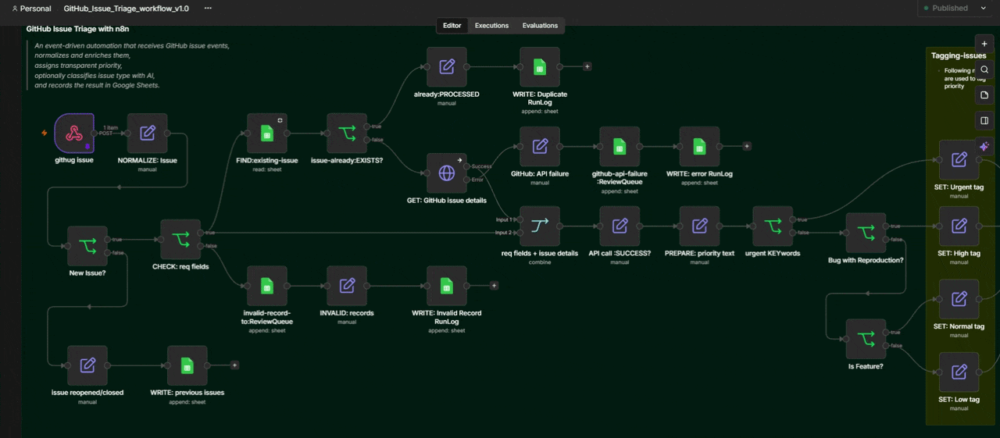
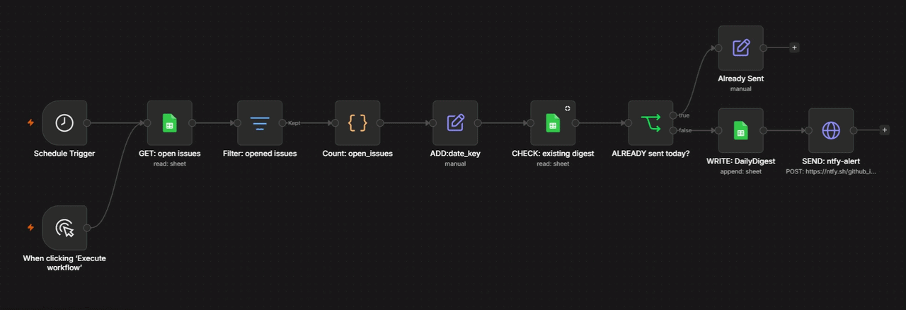

# IssueFlow: GitHub Issue Triage with n8n
> A beginner-built, event-driven automation that intercepts GitHub issue events, normalizes and enriches the data, assigns deterministic priorities, classifies the issue type using an AI LLM, and records the result in a datastore (Google Sheets) with real-time alerting (ntfy.sh).

## Problem
Manual issue triage is repetitive and inconsistent. Software teams are often overwhelmed by unformatted, unlabeled, and duplicate GitHub issues. Triaging these manually takes time away from actual development.

## Solution
IssueFlow is a fully automated, real-time triage system built in n8n. It captures GitHub webhooks, cleans the data, prevents duplicates, enriches it via the GitHub API, identifies urgent cases, classifies the issue type using an AI LLM, writes to a Google Sheets datastore, and sends push notifications for urgent alerts to creates a human-review queue for ambiguous or failed cases.

## See it in Action
**1. Main Triage Workflow (Webhooks & AI Classification)**



**2. Daily Digest Workflow (Aggregation & Alerts)**



> *__Note:__ For full resolution videos click here [[1]](media/github-issue-triage-issueflow.example.execution.mp4), [[2]](media/github-issue-triage-daily-digest.example.execution.mp4).*

## Architecture
The system consists of two primary workflows:
1. **Intake & Triage:** Catches live webhooks and routes them based on strict business logic and AI evaluation.
```text
    GitHub issue (opened/reopened)
    ↓
    n8n Webhook
    ↓
    Deduplication & Validation
    ↓
    Normalize Data
    ↓
    GitHub REST API Enrichment
    ↓
    Priority Routing (Deterministic)
    ↓
    AI Classification (LLM Structured Output)
    ↓
    MasterIssues Datastore / ReviewQueue
    ↓
    ntfy.sh Urgent Alert
    ↓
    RunLog
```
See [`architecture`](docs/architecture.mmd) for the full visual diagram and [`design-decisions`](docs/design-decisions.md) for architectural choices.

2. **Daily Digest:** A scheduled cron job that aggregates open issues into a summary report.

## Features
* **Webhook Intake & Validation:** Safely rejects malformed or irrelevant payloads using a "front-door bouncer" to drop irrelevant non-`opened` events (e.g., `labeled`, `edited`) to prevent webhook `race` conditions.
* **Idempotency & Deduplication:** Prevents duplicate processing using GitHub Delivery IDs and unique Issue Keys.
* **Data Normalization:** Flattens complex, nested `JSON` payloads and validates required fields.
* **API Enrichment:** Securely fetches live issue metadata via the GitHub REST API.
* **Deterministic Priority:** Assigns `urgent`, `high`, `normal`, or `low` status based on strict keyword and label rules before AI intervention to guarantee reliability.
* **Safe AI Classification:** Enforces strict `JSON schemas` (Structured Output Parsing) to categorize issues, safely catching hallucinations, prompt injections, and low-confidence (<0.85) results.
* **Review Paths:** Routes failed API calls or AI hallucinations to a manual `ReviewQueue`.
* **Observability:** Records every success, skipped duplicate, and failure to a dedicated `RunLog` sheet.
* **Real-Time Alerts:** Triggers instant push notifications for critical emergencies via `ntfy.sh`.
* **Automated Reporting:** A secondary cron-based workflow aggregates open issues and delivers a *Daily Digest*.

## Tools

| Tool | Role | Cost |
|---|---|---|
| **n8n** |Workflow orchestration | `free self-hosted` |
| **GitHub** |Event source, Webhooks, and REST API | `free webhook/API` |
| **Google Sheets** |Datastore for MasterIssues, ReviewQueue, and RunLog | `free` |
| **groq API** |Fast, cloud-based LLM for structured AI classification | `free limited` |
| **ntfy.sh** |Real-time HTTP push notifications for urgent alerts | `free` |
| **Ollama** |Local AI endpoint for unlimited testing. model: `llama3.2:3b`| `optional/free` |
| **ngrok** |Secure tunneling for local webhook development with fixed url | `free.dev` |
| **cloudflared** |Instant tunneling without need of install/configure |`optional/free` |

## Setup & Prerequisites
>To run these `.example.json` workflows yourself:

**Prerequisites:**
* Docker (to run n8n locally)
* Ngrok or Cloudflared (for exposing the local webhook to the internet)
* Groq API Key (for the LLM node)
* GitHub Personal Access Token (PAT)
* Google Cloud Console account (for Sheets API)

**Installation Steps:**
1. **Start n8n:** Run n8n locally using Docker (`docker run -it --rm --name n8n -p 5678:5678 -v n8n_data:/home/node/.n8n docker.n8n.io/n8nio/n8n`).
2. **Open Tunnel:** Start an Ngrok tunnel to expose your local n8n instance to the web (`ngrok http 5678` ).
3. **Import Workflows:** Clone this repository and import the `.example.json` files from the [**`workflows/`**](workflows/) directory into your n8n workspace.
4. **Configure Credentials in n8n:**
   * Authenticate your Google Sheets account.
   * Add your GitHub PAT.
   * Add your Groq API Key for the LLM Chain node.
5. **Prepare Datastore:** Create a Google Sheet with four exact tabs: `MasterIssues`, `ReviewQueue`, `RunLog`, and `DailyDigest`.
6. **Configure Webhook:** Go to your GitHub repository settings and create a webhook pointing to your n8n Production URL (via your Ngrok domain). Subscribe only to `Issues` events.
7. **Configure Alerts:** Update the HTTP Request nodes with your private `ntfy.sh` topic to receive push notifications.

## Testing & Evidence
This system was built using Test-Driven Development (TDD) principles, accounting for both "Happy Paths" and explicit failure modes.

- **Test Matrix:** The full execution history of all 14 core tests is documented in [**`test-cases.md`**](tests/test-cases.md).
- **Sample Payloads:** Raw JSON fixtures used for testing (including AI hallucination attempts) are located in [**`samples/`**](samples/).
- **Visual Proof:** Annotated execution graphs proving branch routing are located in [**`screenshots/`**](screenshots/).


## Security
This repository contains fictional test data. No private keys, OAuth credentials, or real IP addresses are stored in this repository. All workflow exports are sanitized.
A production deployment would require stronger secret management, access control, monitoring, and a database appropriate to the workload.

## Lessons Learned
Building this project reinforced several advanced automation concepts:
- Designing **deterministic** fallback rules to protect databases from AI hallucinations.
- Handling API status codes (`401`, `404`, `429`) gracefully without crashing the execution pipeline.
- Preventing webhook **race conditions** and ensuring **idempotency**.
- Using Structured Output Parsers to strictly define LLM **JSON schemas**.
- Building observable systems where "silent failures" are eliminated via comprehensive `RunLogs`.
- Integrating HTTP, JSON parsing, webhooks, expressions, credentials, branching, Sheets mapping, retries, AI output validation, scheduling and documentation.

## Limitations
* Currently, Google Sheets is used as a learning datastore. In a true production environment, this would be swapped out for a robust database like PostgreSQL or directly synced to a ticketing system like Jira/Linear.
* Future improvements could include webhook signature verification, a database with uniqueness constraints, automated regression tests, richer monitoring, and a controlled notification service.